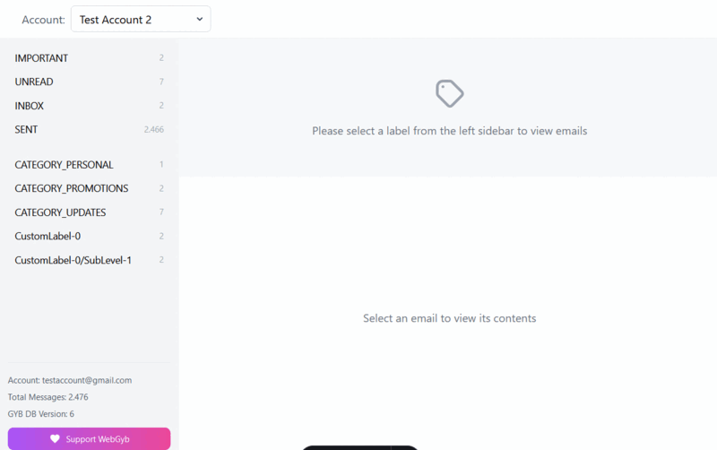

#  WebGYB

A web interface for viewing GMail backups created by [Got-Your-Back (GYB)](https://github.com/GAM-team/got-your-back)

[](https://github.com/davidedg/webgyb/actions/workflows/docker-publish.yml) [](https://hub.docker.com/r/davidedg/webgyb)


<div align="center">
  
</div>

---

## Features

- **Multi-Account Support**
  - Switch between multiple GMail accounts seamlessly
- **Labels Management**
  - Support for GMail labels
  - Label counts and organization
- **Safe Rendering**
  - Secure email content rendering (enabled by default)
  - Protection against malicious content
  - Sanitized HTML display
- **Email Management**
  - View original email source
  - Download emails in EML format
- **Multi-platform support (amd64,arm64,armv7)**
- **Under Development**
  - Attachment handling
  - Improved UX and responsiveness
  - Search Feature

## Docker Quick Start

```bash
docker pull davidedg/gybweb
docker run -d -p 3000:3000 -v "/path/to/gyb/accounts:/app/accounts" davidedg/gybweb
```

Where `/path/to/gyb/accounts` is the path to a directory structure like this:

```
  accounts/
  └── {account1}/
      ├── msg-db.sqlite
      └── {email_folders}/
  └── {account2}/
      ├── msg-db.sqlite
      └── {email_folders}/
  ...
  ```
The application will be available at `http://localhost:3000`

## Docker Compose Quick Start

```yaml
services:
  webgyb:
    image: davidedg/webgyb
    container_name: webgyb
    init: true
    user: "1000:1000"
    ports:
      - "3000:3000"
    volumes:
      - /path/to/gyb/accounts:/app/accounts:ro
      - /path/to/a/standalone/account1/app/accounts/account1:ro
      - /path/to/a/standalone/account2/app/accounts/account2:ro
    environment:
      - PUID=1000
      - PGID=1000
      - NODE_ENV=production
      - HOST=0.0.0.0
      - PORT=3000
      - GYB_ACCOUNTS_DIR=/app/accounts
    restart: unless-stopped
    healthcheck:
      test: ["CMD", "curl", "-f", "http://localhost:3000/"]
      interval: 30s
      timeout: 10s
      retries: 3
      start_period: 10s 
```

The application will be available at `http://localhost:3000`


## Development

1. Clone the repository:
   ```bash
   git clone https://github.com/davidedg/webgyb.git
   cd webgyb
   ```

2. Install dependencies:
   ```bash
   npm install
   ```

3. Start the application in development mode:
   ```bash
   npm run dev
   ```

The application will be available at `http://localhost:4321`

## Building for Production

Create a production build:

```bash
npm run build
```

The built files will be in the `dist` directory.

## Building Docker Images

-  [Dockerfile](Dockerfile)
-  [docker-build.sh](docker-build.sh)


## Contributing

Contributions are welcome! Please feel free to submit a Pull Request.

1. Fork the Project
2. Create your Feature Branch (`git checkout -b feature/AmazingFeature`)
3. Commit your Changes (`git commit -m 'Add some AmazingFeature'`)
4. Push to the Branch (`git push origin feature/AmazingFeature`)
5. Open a Pull Request

## Support

If you find WebGYB useful, please consider supporting it:

[](https://github.com/sponsors/davidedg) <a href="https://www.buymeacoffee.com/davidedg" target="_blank"></a>

---

<div align="center">
Made with ❤️ by <a href="https://github.com/davidedg">davidedg</a>
</div>